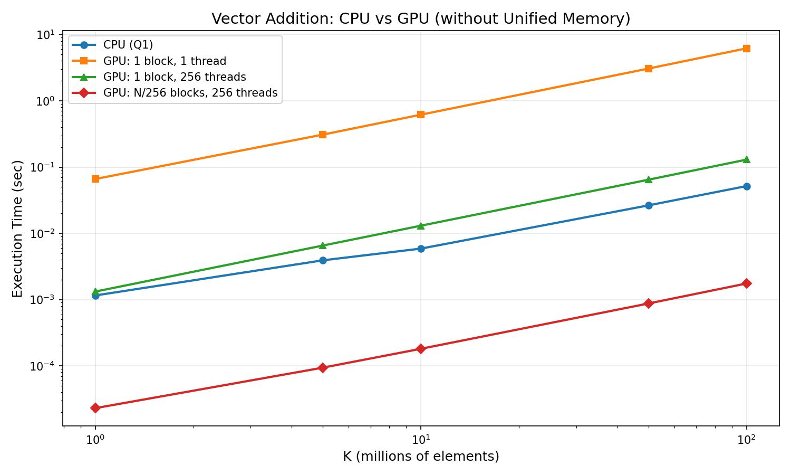
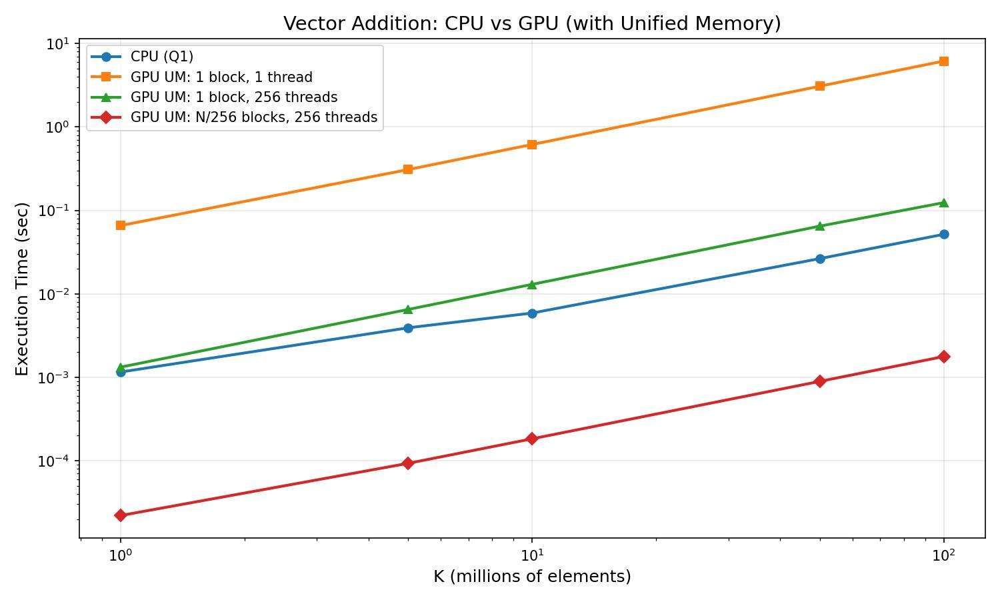

**COMS E6998: High Performance Machine Learning**  
**Prof. Kaoutar El Maghraoui**  
**Spring 2026**  

# Homework Assignment 3 - CUDA

**Wei Alexander Xin (wax1)**

---

## Setup

- **GPU:** NVIDIA RTX A6000 (48GB VRAM)
- **CUDA:** 12.9 (V12.9.86)
- **Driver:** 575.57.08
- **OS:** Linux (Insomnia HPC Cluster, Columbia University)
- **CPU:** AMD EPYC 7643 48-Core (2 sockets, 192 threads total, up to 3.6 GHz)
- **Cluster:** Insomnia | partition: burst | account: edu

---

## Part-A: CUDA Matrix Operations (40 pts)

### Problem-1: Vector add and coalescing memory access

#### Q1: vecadd00

| ValuesPerThread | Vector Size | Time (sec) | GFlops/s | GBytes/s |
|-----------------|-------------|------------|----------|----------|
| 500 | 3,840,000 | 0.000199 | 19.31 | 231.74 |
| 1000 | 7,680,000 | 0.000362 | 21.21 | 254.47 |
| 2000 | 15,360,000 | 0.000739 | 20.79 | 249.47 |

#### Q2: vecadd01

| ValuesPerThread | Vector Size | Time (sec) | GFlops/s | GBytes/s |
|-----------------|-------------|------------|----------|----------|
| 500 | 3,840,000 | 0.000196 | 19.59 | 235.13 |
| 1000 | 7,680,000 | 0.000384 | 20.01 | 240.09 |
| 2000 | 15,360,000 | 0.000760 | 20.21 | 242.50 |

**Observations:**

- The timings between coalesced and non-coalesced are surprisingly close (~1-2% difference). We expected the coalesced kernel to be noticeably faster, since non-coalesced access should cause more cache line waste.
- One likely explanation is that the A6000 has large L1/L2 caches that seem to effectively mask the non-coalesced access pattern at these vector sizes. The vectors likely fit comfortably in cache, so even "bad" access patterns get served without too many extra memory transactions.
- On older GPUs with smaller caches, this gap should be much more significant. The coalescing optimization is still worth doing as a default since it costs nothing, but modern hardware is more forgiving than the textbook suggests.
- Both kernels achieve ~20 GFlops/s, which seems reasonable for a simple element-wise add. This operation is memory-bandwidth bound (3 memory ops per 1 flop), so we wouldn't expect the GFlops number to be anywhere near the GPU's peak compute power.

### Problem-2: Shared CUDA Matrix Multiply

#### Q3: matmult00, FOOTPRINT=16

| NumBlocks | Matrix Size | Time (sec) | GFlops/s |
|-----------|-------------|------------|----------|
| 16 | 256x256 | 0.000024 | 1393.44 |
| 32 | 512x512 | 0.000104 | 2582.34 |
| 64 | 1024x1024 | 0.000711 | 3020.52 |

#### Q4: matmult01, FOOTPRINT=32

| NumBlocks | Matrix Size | Time (sec) | GFlops/s |
|-----------|-------------|------------|----------|
| 8 | 256x256 | 0.000030 | 1116.96 |
| 16 | 512x512 | 0.000123 | 2181.98 |
| 32 | 1024x1024 | 0.000709 | 3028.65 |

**Comparison:**

| Matrix Size | Baseline GFlops | Optimized GFlops | Speedup |
|-------------|----------------|-----------------|---------|
| 256x256 | 1393 | 1117 | 0.80x |
| 512x512 | 2582 | 2182 | 0.85x |
| 1024x1024 | 3021 | 3029 | 1.00x |

**Observations:**

- The thread-coarsened kernel (4 outputs per thread) is actually slower(!) at smaller matrix sizes, which was not what we expected going in.
- The reason seems to be the 4-phase shared memory loading: each iteration needs to load shared_A and shared_B tiles 4 times instead of once, with an extra __syncthreads() barrier between each phase. For small matrices, this synchronization overhead appears to outweigh any benefit from computing more outputs per thread.
- At 1024x1024, the two kernels converge to roughly the same performance. This makes sense because the ratio of useful compute to synchronization overhead should improve as the matrix gets larger, since there are more multiply-accumulate operations per tile load.
- It seems like the A6000's large register file and caches make the baseline kernel already pretty darn efficient, leaving less room for the coarsened version to improve on.
- Thread coarsening should show more benefit on older architectures, or with larger matrices where the reduced number of thread blocks means less scheduling overhead. We would need to test with matrices larger than 1024x1024 to see if the optimized kernel eventually pulls ahead.

#### Q5: Personal rules of thumb

Based on experiments in this assignment:

1. **Parallelism, Parallelism, Parallelism.** The single biggest performance factor is how many threads are doing useful work. A single GPU thread is _orders of magnitude_ slower than a CPU (Part B scenario 1 vs CPU). Fully utilizing the GPU (scenario 3) yields 30x+ speedups.

2. **Memory coalescing matters less on modern GPUs.** The A6000's large L1/L2 caches masked the non-coalesced access pattern in Part A Q1 vs Q2 (~1-2% difference). On older architectures this gap would be much larger. Still, coalescing is free and should be the default.

3. **More work per thread is not always better.** Thread coarsening (Part A Q4) added overhead from extra shared memory loads and synchronization barriers that negated the benefit at small matrix sizes. Only at 1024x1024 did it break even. So basically, test everything.

4. **Kernel launch and library overhead can dominate.** cuDNN was slower than a handmade naive kernel for our single double-precision convolution (Part C). It seems these libraries are optimized for production workloads (float32, large batches), but can and do baggage if applied to smaller jobs like our one-off academic benchmarks.

5. **Always profile your stuff!** The assumptions that "tiled > naive" and "cuDNN > handmade" was wrong for this specific workload. The only reliable optimization strategy is to measure first, then diagnose and optimize bottlenecks.

---

## Part-B: CUDA Unified Memory (20 pts)

### Q1: CPU

| K (millions) | N | Time (sec) |
|-------------|---|------------|
| 1 | 1,000,000 | 0.001155 |
| 5 | 5,000,000 | 0.003917 |
| 10 | 10,000,000 | 0.005884 |
| 50 | 50,000,000 | 0.026447 |
| 100 | 100,000,000 | 0.051670 |

### Q2: GPU, no Unified Memory

| K | Scenario 1 (1 blk, 1 thr) | Scenario 2 (1 blk, 256 thr) | Scenario 3 (N/256 blks, 256 thr) |
|---|---------------------------|-----------------------------|---------------------------------|
| 1 | 0.066098 | 0.001322 | 0.000023 |
| 5 | 0.309232 | 0.006546 | 0.000094 |
| 10 | 0.617994 | 0.013048 | 0.000181 |
| 50 | 3.071301 | 0.064532 | 0.000874 |
| 100 | 6.196604 | 0.129598 | 0.001750 |

### Q3: GPU, Unified Memory

| K | Scenario 1 (1 blk, 1 thr) | Scenario 2 (1 blk, 256 thr) | Scenario 3 (N/256 blks, 256 thr) |
|---|---------------------------|-----------------------------|---------------------------------|
| 1 | 0.065797 | 0.001322 | 0.000022 |
| 5 | 0.308506 | 0.006501 | 0.000093 |
| 10 | 0.616446 | 0.012986 | 0.000183 |
| 50 | 3.080942 | 0.064783 | 0.000893 |
| 100 | 6.163072 | 0.123869 | 0.001773 |

### Q4: Visualization

**CPU vs GPU w/o Unified Memory (Q1, Q2):**



**CPU vs GPU w/ Unified Memory (Q1, Q3):**



**Observations:**

- Scenario 1 (1 thread) is dramatically slower than CPU at all tested sizes. This makes sense: we're essentially running a sequential `for` loop on the GPU, but with the added cost of kernel launch overhead and the fact that a single GPU core runs at a lower clock speed than a CPU core. The GPU's strength is parallelism, and scenario 1 uses none of it.
- Scenario 2 (256 threads, 1 block) uses only one SM. Interestingly, CPU is still faster at all tested sizes. At K=100, scenario 2 is ~2.5x slower than CPU (0.130s vs 0.052s), which suggests that a single SM cannot compete with a 48-core EPYC (I mean who could?) for a memory-bound operation. Intuition says scenario 2 might overtake CPU at larger K values, since the GPU's memory bandwidth benefit should compensate for the launch overhead, eventually. But this was not tested.
- Scenario 3 (full grid) is the clear winner at all tested sizes. At K=100, it's roughly 30x faster than CPU (0.00175s vs 0.0517s). This seems to confirm that the key to GPU performance is saturating the hardware with enough parallel work to keep as many SMs busy as possible.
- Unified vs non-unified memory shows virtually no difference in kernel execution time. This was a bit surprising at first, but it seems like the warmup run effectively hides the initial page migration cost (the first kernel call triggers the data transfer, and subsequent calls find the data already resident on the GPU). It's also worth noting that our timing only measures kernel execution, not the data transfer itself, so any migration cost during the first (warmup) run wouldn't show up in our measurements.
- All configurations scale linearly with N, which is expected for a simple element-wise operation. The slopes differ by orders of magnitude depending on how much parallelism each scenario uses.

---

## Part-C: Convolution in CUDA (50 pts)

**Convolution parameters:**

- Input: C=3, H=1024, W=1024 (double precision)
- Filters: K=64, C=3, FH=3, FW=3 (double precision)
- Padding: P=1, Stride: 1
- Convolution (not cross-correlation): filter transposed in the formula

### Results

| Implementation | Checksum | Time (ms) |
|---------------|----------|-----------|
| C1: Basic (no tiling) | 1.227563e+14 | 6.234 |
| C2: Tiled + shared memory | 1.227563e+14 | 5.907 |
| C3: cuDNN | 1.227563e+14 | 7.434 |
| C4: Triton (bonus) | Verified* | 198.729 |

#### Raw program output
program_output.csv:
 
> ```
> 1.227563e+14,6.234
> 1.227563e+14,5.907
> 1.227563e+14,7.434
> 198.729
> ```

All C1-C3 checksums match, confirming correctness. C4 correctness verified via `torch.testing.assert_close` against PyTorch's `F.conv2d`.

*C4 uses float32 (skeleton uses `torch.rand`) and cross-correlation (matching `F.conv2d`), so the checksum differs from C1-C3's double-precision convolution.

### C4: Triton ~*Bonus, 10 pts*~

- **GPU:** NVIDIA RTX A6000 (same as C1-C3)
- **Precision:** float32 (per skeleton, uses `torch.rand`)
- **Execution time:** 198.729 ms
- **Correctness:** Verified via `torch.testing.assert_close` against `F.conv2d`
- **Also tested on:** T4 (711.130 ms, Google Colab) and H100 (105.766 ms, Insomnia)

The Triton kernel is ~30x slower than C1-C3. The likely reason is that our implementation launches one program instance per output element (C_OUT x H x W = 64 x 1024 x 1024 = ~67 million programs), and each instance only does 27 multiply-adds (C_IN x FH x FW = 3 x 3 x 3). This seems like extremely fine-grained parallelism: the ratio of useful work to launch/scheduling overhead is very low, and there is no data reuse between neighboring programs even though they read overlapping input regions.

A more optimized Triton convolution would likely tile over output pixels, so that each program computes a block of outputs rather than a single element. This would allow the program to load a shared chunk of input into fast local memory and reuse it across multiple output computations, similar to what C2 does with CUDA shared memory. That kind of tiling should significantly close the performance gap with the hand-written CUDA kernels.

**Observations:**

- All three CUDA implementations produce identical checksums, confirming correctness.
- C1 and C2 are very close in performance (~6ms). The 3x3 filter is quite small, so the tiling overhead (loading an 18x18 shared memory tile with halo, plus extra synchronization) seems to roughly break even with the global memory savings. Across runs, C2 sometimes edges out C1 slightly, which suggests the benefit is real but marginal for this filter size. With larger filters (say 7x7 or 11x11), the data reuse from tiling should become much more significant.
- cuDNN is the slowest of the three (~7.4ms), which was surprising. Our hypothesis is that cuDNN's algorithm selection and workspace management add fixed overhead, which isn't amortized when running a single convolution in double precision. cuDNN seems to be optimized for production workloads (float32, large batches, many layers), where this setup cost would be negligible relative to the total job size.
- C4 (Triton) at 199ms is ~30x slower, but as discussed above, this is likely due to our naive one-element-per-program approach rather than a limitation of Triton itself.
- We also ran C4 on three different GPUs: T4 (711ms), A6000 (199ms), and H100 (106ms). The scaling roughly tracks the compute throughput of each GPU, which makes sense for a workload that launches millions of tiny programs. The scheduling and dispatch hardware on faster GPUs can churn through more program instances per second.

---

### -= FIN =-